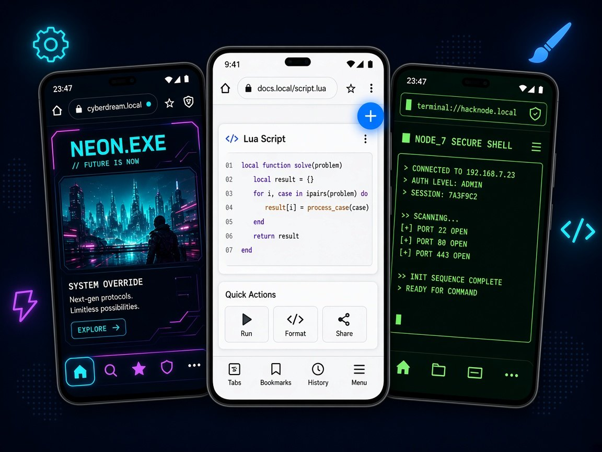

<p align="center">
  
</p>

<h1 align="center">LemurX</h1>

<p align="center">
  <strong>The browser that runs your code.</strong><br>
  Official Chromium · Android · Lua 5.4 · no extension system
</p>

<p align="center">
  <a href="https://kevinlinpr.github.io/LemurX/">Website</a>
  ·
  <a href="LICENSE">BSD-3-Clause</a>
  ·
  <a href="src/chrome/lemurx/lua/docs/LUA_GUIDE.md">Lua guide</a>
  ·
  <a href="CONTRIBUTING.md">Contributing</a>
  ·
  <a href="SECURITY.md">Security</a>
</p>

LemurX is an Android browser built on the official Chromium stable channel,
with Lua 5.4 living *inside* the browser process, in every renderer, and in
the native shell. There is no WebExtensions API. Drop a `.lua` file in
`files/lua/`, restart, and the browser is yours.

An extension is a guest. It sees what the host chooses to show it. A script
here *is* the host: it can veto a navigation before it commits, rewrite every
subresource request synchronously inside the renderer, hold real main-world
DOM handles, register its own URL schemes, drive the full DevTools Protocol
without a cable, and replace the native shell with a widget tree it draws
itself.

<p align="center">
  
</p>

## Extensions ask permission. Scripts just do it.

A Chrome extension lives in a sandbox on the far side of an API designed to
keep it out. A LemurX script runs in the browser process, next to Chromium's
own code.

| Can you… | Chrome extension | LemurX script |
|---|---|---|
| Rewrite response bodies on the fly | Headers and redirects only | `net.addRule{ replaceBody = … }` |
| Put a button on the real toolbar | Popups and side panels | `ui.render("toolbar.end", …)` |
| Dump, restyle, or tear out any native View | — | `ui.dump()` · `ui.style()` · `ui.replace()` |
| Full DevTools Protocol on a phone | Desktop, one domain at a time | `cdp.send(tab, "Any.method", …)` |
| Fetch anything, no CORS, no host permissions | Declare every host up front | `http.fetch(url)` |
| Read and write Chromium prefs, site permissions, feature flags | — | `prefs.set` · `perm.set` · `features.enabled` |
| Run Lua inside every renderer, on real DOM handles | — | `page` · `dom_document` · `send-request` |
| Drive other apps, not just the page | — | `system.tree` · `system.tap` · `agent.run` |
| Share a script with strangers | Store review | Sandboxed UGC domain, its own `lua_State` |

## Every layer, scriptable

The full reference is [`src/chrome/lemurx/lua/docs/LUA_GUIDE.md`](src/chrome/lemurx/lua/docs/LUA_GUIDE.md).
`lemurx.help()` prints the same catalog from the REPL.

* **`lemurx.*`** — tabs, network rules, HTTP, files, storage, shell, declarative
  native UI, native view surgery, input, cookies, history, prefs, the whole
  Chrome DevTools Protocol. Local scripts get the full standard library:
  `io`, `os`, `debug`, `require`.
* **luakit, on a phone** — the C-level Lua API of
  [luakit](https://luakit.github.io/) reimplemented on Chromium: `widget{}`
  trees mapped to Android views, `webview` bound to a tab,
  `luakit.register_scheme`, `sqlite3`, `regex`, `soup`, `stylesheet`, `timer`,
  `download`, `ipc_channel`. The standard module set (`window`, `webview`,
  `modes`, `binds`, `lousy.*`, `follow`, `adblock`, `formfiller`, `session`,
  the `luakit://` pages) is a clean-room rewrite, so an `rc.lua` written for
  luakit runs here.
* **Lua in the renderer** — one `lua_State` per renderer with `page`,
  `dom_document`, `dom_element` on real V8 handles, a synchronous
  `send-request` hook on every subresource, and `luakit.register_function` to
  expose Lua to page JavaScript.
* **Two trust domains.** Scripts on your device run with full power. Scripts
  from other people (`files/lua/ugc/`) get their own `lua_State`, a reduced
  standard library, and no privileged APIs (`cookie`, `history`, `cdp`,
  `prefs`, `system`, luakit natives). Text-only `load`, no bytecode. The
  boundary is enforced at runtime, per state.

```lua
-- files/lua/10_clean.lua — block a tracker, then strip leftovers in every frame.
lemurx.net.addRule({
  match  = "*://*.doubleclick.net/*",
  action = "block",
})

lemurx.tabs.on("loaded", function(ev)
  lemurx.tabs.inject(ev.id, [[
    document.querySelectorAll('.ad, [id^="ad-"]').forEach(function (e) { e.remove(); })
  ]], { world = "isolated", frames = "all" })
end)
```

## Official scripts: the popular Chrome extensions, rewritten in Lua

Exposing APIs is not the point; what people actually want is the extensions
they already use. `src/chrome/lemurx/lua/official/` ships complete Lua
re-implementations of the most-installed Chrome extensions, bundled in the apk
and listed under **Lua scripts** in the menu, each with its own
`lemurx://<id>/` settings page:

| Script | Replaces |
|---|---|
| `adblock` | uBlock Origin · AdBlock · Adblock Plus · AdGuard — ABP-compatible engine, EasyList & friends, synchronous subresource blocking in the renderer, cosmetic filters |
| `userscripts` | Tampermonkey — `==UserScript==` metadata, `@match`/`@require`/`@resource`, the `GM_*` API, one-tap install from Greasy Fork |
| `darkmode` | Dark Reader — Chromium's native Force Dark driven from Lua, plus filter / static CSS engines |
| `translate` | Google Translate · Immersive Translate — bilingual page translation, selection popup, Google / Microsoft / DeepL / OpenAI-compatible engines |
| `privacy` | Privacy Badger · ClearURLs · DuckDuckGo Privacy Essentials — tracker learning, URL cleaning, GPC/DNT, HTTPS upgrade, site grade |
| `tabs` | OneTab · Session Buddy · The Great Suspender |
| `newtab` | Momentum · Todoist · Earth View — the stock NTP replaced by a Lua page |
| `jsonviewer` | JSON Viewer |
| `video` | Picture-in-Picture · Global Speed · Volume Master |
| `ai` | Sider · Monica · HARPA · Grammarly · QuillBot · Wordtune · LanguageTool — any OpenAI-compatible endpoint, keys stay in the browser process |
| `focus` | StayFocusd · Toggl Track |
| `useragent` | User-Agent Switcher |
| `wappalyzer` | Wappalyzer |
| `screenshot` | FireShot — full-page capture over CDP, canvas annotation editor |
| `octotree` | Octotree |
| `clipper` | Google Keep · Save to Google Drive · Evernote Web Clipper — readability extraction to Markdown, share to any app |

The full 50-extension coverage table, and the list of low-level capabilities
that were added to Chromium/Java/C++ because a script needed them, is in
`src/chrome/lemurx/lua/official/CATALOG.md`. The scripts share a small
framework, `lx` (`official/lx/`), documented in chapter 8 of the Lua guide;
local scripts can `require("lx")` too.

Users see all of this in a native activity (**Lua scripts** in the menu):
official, local and UGC scripts grouped, per-script switches, metadata parsed
from the file header, source view, in-place editing for local/UGC scripts, and
"copy to local" to fork an official script.

## The user always wins

Depth of customisation is only worth anything if it never costs the user
control of the browser. Three guarantees back that:

* **Stock when idle.** Every hook LemurX adds to Chromium (URL-loader
  throttles, navigation throttles, certificate override, custom schemes, back
  press, app menu, tab observers, renderer Lua) is gated on state that only a
  script can create. With no script running, each hook is an early `return`
  and the browser behaves like the official build it was compiled from.
* **A native master switch.** The three-dot menu always ends with **Lua
  scripts**: a plain Android activity (no Lua involved, scripts cannot hide or
  intercept it) with an on/off switch for the runtime and a switch per
  script — the official scripts, your local scripts, and `ugc/` scripts alike.
  Applying a change tears down everything scripts did — net rules, attached
  webviews, certificate whitelist, CDP sessions, schemes, timers, overlays,
  widgets, skin, per-tab UA/headers — stops the Lua engine
  (`LemurXEngine::Stop`), and recreates the activity so the shell is inflated
  from stock resources. Turning it back on starts a fresh `lua_State` and
  re-runs the scripts. The switch lives in its own preference file that no
  Lua API can reach.
* **Boot-loop protection.** If the process dies twice in a row within 20 s of
  starting scripts, the runtime is disabled automatically and the browser
  comes up stock with a notice; a script can never lock you out of the
  browser you need to fix it.

## Layout

```
CHROMIUM_VERSION   pinned official Chromium release
chromium/          .gclient + fetch.sh; the checkout itself is not tracked
src/               overlay — files that do not exist upstream, mirrored at the same paths
  chrome/browser/lemurx/               browser-process Lua: net rules, throttle, cookies
  chrome/browser/ui/android/lemurx/    Lua engine, lemurx.* API, CDP, luakit natives
  chrome/renderer/lemurx/              renderer-embedded Lua (luakit web extension model)
  chrome/common/lemurx_web.mojom       browser <-> renderer Lua IPC
  chrome/android/java/.../lemurx/      Java hosts (shell, UI, widgets, moat)
  chrome/lemurx/lua/                   init.lua, tutorial, examples, docs
  chrome/lemurx/lua/official/          official scripts (Lua rewrites of Chrome extensions) + lx framework, CATALOG.md
  chrome/lemurx/luakit/                luakit-compatible runtime: kernel/, lib/, lousy/, config/
  chrome/lemurx/brand/                 Android branding: launcher icons, app_name, logo drawables
  chrome/lemurx/discover/              strings for the NTP Discover news stream
  chrome/lemurx/ntp/                   NTP overlay: LemurX wordmark, Lemur search box, favorites UI
  chrome/app/theme/lemurx/             BRANDING + product logos (branding_path_component)
  components/resources/*/lemurx/       chrome://version logo
  components/vector_icons/lemurx/      product.icon (QR code centre, etc.)
  third_party/lua/                     Lua 5.4.7
patches/           unified diffs for the handful of upstream files we hook into
tools/apply.py     lays src/ + patches/ over chromium/src
tools/args.gn      default GN args (arm64, official, enable_extensions=false)
tools/brand/       master logo + gen_brand_assets.py (regenerates everything above)
```

Everything LemurX adds lives in `src/` and `patches/`; the Chromium tree is
pristine upstream at the pinned tag. There is no fork.

### Branding

The shipped app is branded LemurX end to end without editing any upstream
resource file:

- `branding_path_component = "lemurx"` (in `tools/args.gn`) points Chromium's
  own branding switch at `src/chrome/app/theme/lemurx/` (BRANDING → product
  name/company in version info, `product_logo_*.png`, svg) and
  `src/components/vector_icons/lemurx/product*.icon`.
- `//chrome/lemurx/brand:brand_resources` is an `android_resources` target with
  `resource_overlay = true`: aapt2 takes its launcher icons, `app_name` and every
  drawable that upstream draws the Chrome logo with (`chrome_logo_24dp`,
  `chrome_sync_logo`, `chromelogo16`, `chrome_logo_blue`, promo illustrations, …)
  instead of the upstream resources of the same name.
- `patches/tools_grit_grit_node_message.py.patch` rewrites "Chromium" /
  "Chrome" / "Google Chrome" to "LemurX" in every emitted UI string, in every
  language, at grit output time. Message ids are untouched so translations keep
  matching; ChromeOS, Chromebook, Chromecast, Chrome Web Store, Chrome
  Enterprise and lowercase `chrome://` URLs are left alone. The user agent is
  unaffected (it is not a grit string).
- Code identifiers (`org.chromium.*`, `chrome/` paths, `lemurx.chrome.*` Lua API)
  keep their names; they are not user-visible.

Regenerate all assets from the master logo with
`python3 tools/brand/gen_brand_assets.py` (needs Pillow), then `tools/apply.py`.

### Discover (new tab page news)

Chromium's Discover feed renders through the proprietary xsurface library,
which is only a stub in public builds, so upstream can never show anything but
"can't refresh". LemurX keeps the whole upstream surface — the "Discover"
header, its on/off switch, the `ARTICLES_LIST_VISIBLE` pref — and swaps only the
content stream: `FeedSurfaceCoordinator.createFeedStream()` returns
`LemurXDiscoverStream` (`src/chrome/android/java/.../lemurx/`) instead of
`FeedStream`.

- Data: the Lemur news service, `GET {base}/lemur/news/meta` (country / language
  / category targets) and `GET {base}/lemur/news/headlines?country&lang&category&page&pageSize`
  (50 per page, auto-loads the next page near the bottom).
- Look: the Lemur Discover card — title (16sp, max 3 lines) beside a 98×76dp
  12dp-rounded thumbnail, "source · time" in 10sp below, 16dp between cards.
  Views are plain Android widgets fed to Chromium's `FeedListContentManager`
  as `NativeViewContent`, so the NTP scroll, header and thumbnail capture all
  behave as upstream.
- Base URL: `--lemurx-discover-url=…` > `lemurx_settings` key
  `discover.base_url` > `https://api.lemurbrowser.com/`.
  `discover.enabled=false` in `lemurx_settings` restores the upstream
  `FeedStream`.
- Independent of Lua: the stream does not go through the Lua runtime, so it is
  unaffected by the master switch; scripts that want to own the home page do so
  with `lemurx.skin` / `lemurx.ui` as before.

### New tab page: logo, search box, favorites

The NTP keeps upstream's structure (`NewTabPageLayout`, `LogoCoordinator`,
`SearchBoxCoordinator`, the Discover header/feed below); only what is drawn in
each slot is Lemur's.

- Logo: `//chrome/lemurx/ntp:ntp_resources` (`resource_overlay = true`) replaces
  `ic_google_logo` with the LemurX wordmark (`tools/brand/gen_ntp_logo.py`,
  tinted to the text colour, 42dp tall). `LogoMediator` /
  `NtpCustomizationUtils` are patched to always show the logo and never fetch a
  doodle, whatever the default search engine.
- Search box: same overlay swaps `home_surface_search_box_background` for
  Lemur's `Search_default` pill (48dp, 2dp outline in the text colour, no
  fill) and overrides the `fake_search_box_*` dimens / hint text appearance.
- Favorites: `NewTabPageCoordinator` mounts `LemurXFavoritesCoordinator`
  (`src/chrome/android/java/.../lemurx/favorites/`) where the Most Visited
  tiles used to be. It is Lemur's home-page bookmark grid: 5 per row; tap opens,
  tap a folder expands it in a panel; long-press enters edit mode (selection
  ring, delete badges, rename field) where dragging reorders, dropping one tile
  on another makes a folder and dragging past the folder panel un-nests; tapping
  empty space shows the "+" tile, which opens a bottom sheet listing bookmarks,
  history and a URL field.
  Storage is a small SQLite table (`lemurx_favorites.db`), seeded with the
  Bookmarks and History shortcuts. Favicons come from `LargeIconBridge` with a
  Lemur-style letter fallback.

### Automation base for AI agents

A GUI agent loops observe → decide → act. Deciding is the model's job (a
script talks to whatever LLM it likes over `lemurx.http`); LemurX provides the
other two steps as three layers, all exposed to Lua and all inert until a
script calls them (`src/chrome/lemurx/lua/scripts/agent.lua`,
`LemurXSystemHost.java`, `LemurXAccessibilityService.java`):

| Layer | Observe | Locate | Act | Needs |
|---|---|---|---|---|
| Web page | `tabs.screenshot` | `agent.mark` (set-of-marks via JS), CDP | `input.tap/type`, JS | nothing |
| Browser shell | `ui.screenshot` (whole window) | `ui.dump/find` (stable `ref` per view) | `ui.click/setText/tap/swipe` | nothing |
| Other apps | `system.screenshot` | `system.tree/find` | `system.click/tap/swipe/global` | user enables the accessibility service once |

- `lemurx.agent.observe()` merges the layers into one observation with every
  element in **screen pixels** (web CSS coordinates are mapped through
  `lemurx.tabs.viewport()`); `agent.describe(obs)` renders it as compact text
  with a `ref` per element (`w7` web, `n12` native, `s5` system);
  `agent.act{type="tap", ref="w7"}` executes by ref and picks the most reliable
  path for that layer. `agent.run(policy, opts)` is the loop.
- `lemurx.system.*` is an `AccessibilityService` — the sanctioned, no-root
  equivalent of `adb shell uiautomator dump` / `input tap` / `screencap`
  (`dispatchGesture`, `performGlobalAction`, `takeScreenshot`). It is declared
  in the manifest (`patches/…AndroidManifest.xml.patch`, resources in
  `src/chrome/lemurx/agent/`), off until the user turns it on in
  Settings › Accessibility, privileged-only in Lua, and it stops answering when
  the Lua master switch is off.

See `LUA_GUIDE.md` §4.17 for the full API.

## Build

`chromium/fetch.sh` clones [depot_tools](https://commondatastorage.googleapis.com/chrome-infra-docs/flat/depot_tools/docs/html/depot_tools.html) into `depot_tools/` at the repo root if it is not already on `PATH` via `$DEPOT_TOOLS`.

```sh
./chromium/fetch.sh                      # shallow checkout of the pinned release (Android)
tools/apply.py                           # overlay + patches
cd chromium/src
gn gen out/lemurx --args="$(cat ../../tools/args.gn)"
autoninja -C out/lemurx chrome_public_apk
```

Default GN args are a **local** arm64 release with the royalty-free Chromium
codec set. The app is still branded LemurX (`branding_path_component`).
`ffmpeg_branding` in Chromium names the *codec bundle*, not the product:

| GN | Meaning |
|---|---|
| `ffmpeg_branding = "Chromium"` (default) | VP8/VP9/AV1, Opus, Vorbis — fine to redistribute |
| `ffmpeg_branding = "Chrome"` + `proprietary_codecs = true` | also H.264/AAC — patent licenses required to ship an APK |
| `enable_widevine = true` | Google Widevine CDM — separate agreement |

To add proprietary codecs on a private distribution build (you are responsible
for licenses):

```sh
gn gen out/lemurx --args="$(cat ../../tools/args.gn) ffmpeg_branding=\"Chrome\" proprietary_codecs=true enable_widevine=true"
```

### Distributed build (optional REAPI)

Remote execution is off by default. If you run your own REAPI cluster
(Buildbarn, etc.):

1. Set `use_remoteexec = true` in GN args.
2. Uncomment `reapi_address`, `reapi_instance`, and `reapi_backend_config_path`
   in `chromium/.gclient`. The backend path must be **absolute** and should
   point at `tools/rbe/backend.star` in this repo.
3. `gclient runhooks` (or `configure_siso.py`) installs the backend config.

If the cluster is plaintext gRPC and does not implement
`google.longrunning.Operations`:

```sh
export RBE_service_no_security=true
autoninja -C out/lemurx -reapi_insecure -reapi_keep_exec_stream -remote_jobs 256 chrome_public_apk
```

## Upgrading Chromium

1. Change `CHROMIUM_VERSION` and the `@version` in `chromium/.gclient`.
2. `tools/apply.py --revert && ./chromium/fetch.sh && tools/apply.py`
3. Fix whatever in `patches/` no longer applies (they are deliberately tiny), rebuild.

## Contributing

See [CONTRIBUTING.md](CONTRIBUTING.md). Please read [SECURITY.md](SECURITY.md)
before reporting a vulnerability, and [CODE_OF_CONDUCT.md](CODE_OF_CONDUCT.md)
for community expectations.

## License

Everything in this repository is BSD-3-Clause (`LICENSE`), including the
luakit-compatible Lua runtime, which is an independent re-implementation of
luakit's public API and contains no luakit code. Third-party notices (Chromium,
Lua, markdown.lua) are in `NOTICE`.

This overlay does not grant a license to Google Chrome trademarks, to
third-party extension names used as comparators in docs, or to patent rights
covering H.264/AAC if you enable `ffmpeg_branding = "Chrome"`.
